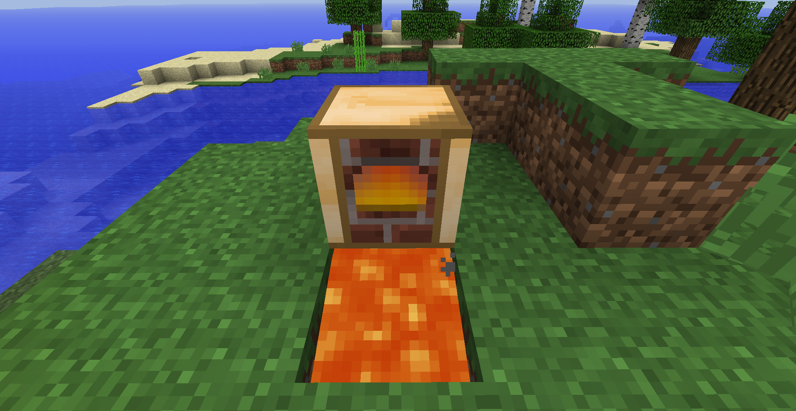
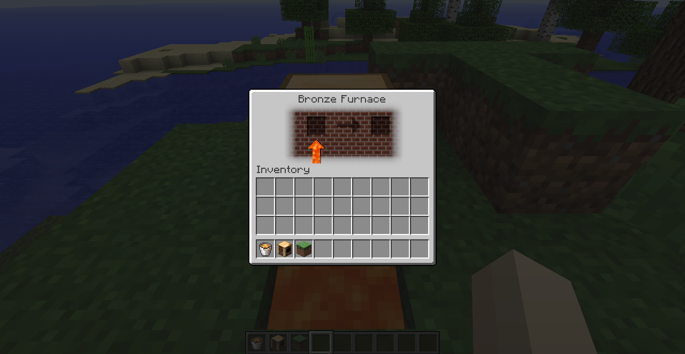

# Better Iron (1.7.10)
This mod makes iron tools and armor more durable (x1.6 more durable tools and x1.33 more durable armor), while making it impossible to smelt iron ore in regular furnace unless lava bucket is used, also introducing new Bronze Furnace which works fuel-less when placed above lava source. The recipe for the Bronze Furnace, of course, uses bronze (and copper), so if you don't have them in your modpack then you'd need to use something like CraftTweaker mod to change its recipe if you want.

This mod also introduces a bunch of customizable values which include (but are not limited to) iron armor and tools durability, gold pickaxe harvest level and sword damage, chainmall armor protection and ecnhantability values, minecart speed.

If Thaumcraft is present, iron clusters will not smelt in regular furnace either (but will in Infernal Furnace), and durability for thaumium tools is set to 700 by default (instead of TC4 vanilla 400), while some other vanilla values are tweaked too. You can change all of them in mod config file to whatever you like.
